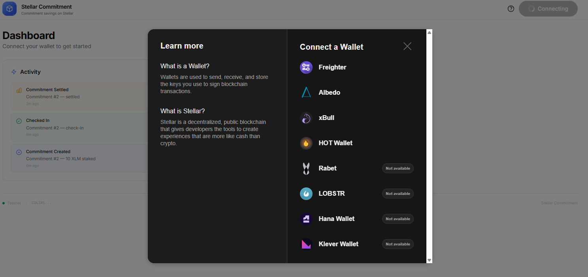
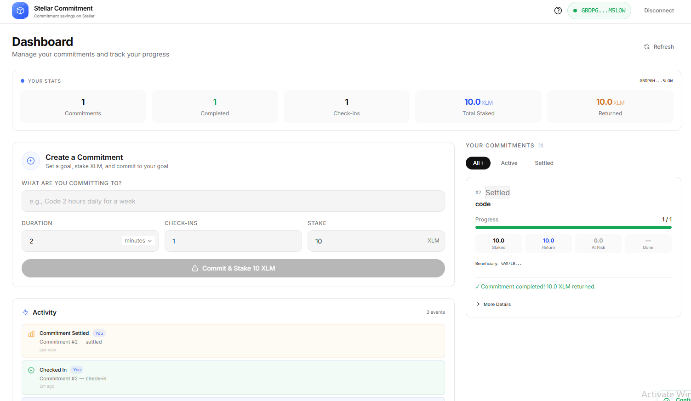
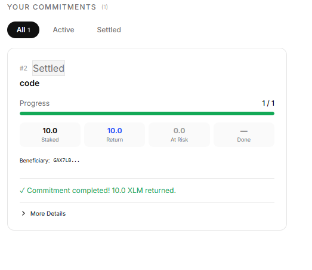
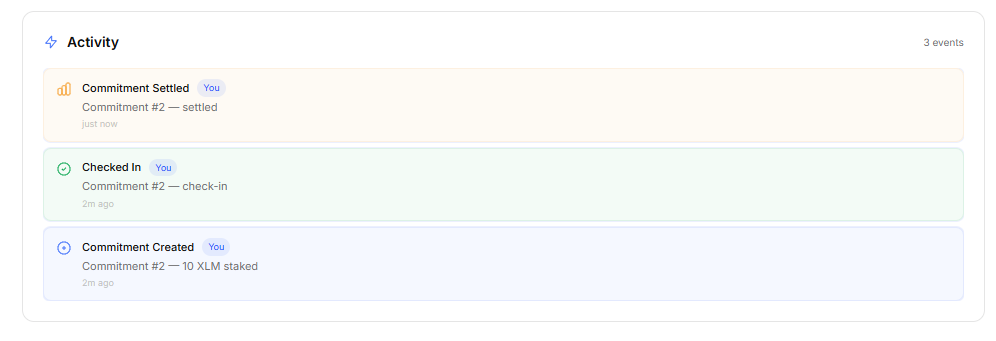

# Stellar Commitment 🔒

**On-chain Commitment Savings on Stellar**

Stellar Commitment is a decentralized accountability app: you stake XLM on a goal, then prove your progress with on-chain check-ins before a deadline. Complete enough check-ins and your stake comes back. Miss your target and the unearned portion is slashed - sent to a beneficiary you choose, or burned if you leave it blank.

## ✨ Features

- **Create Commitments** - Set a goal, stake XLM, pick a duration (minutes, hours, or days), and define how many check-ins prove you stuck with it
- **On-chain Check-ins** - Prove commitment with verifiable transactions
- **Proportional Slashing** - Complete X of Y check-ins to get (X/Y) of your stake back; the rest is slashed
- **Strict Penalty Mode** - Optional. Below 50% check-ins and your *entire* stake is slashed
- **Burn or Beneficiary** - Leave the beneficiary blank and slashed XLM is burned (stays in the contract, unreachable by anyone). Add a friend's address and it goes to them
- **Multi-wallet Support** - Freighter, Lobstr, Albedo, Rabet, xBull, Hana and more via StellarWalletsKit
- **Transaction Status** - Pending / success / failed toasts with explorer links for every action
- **Activity Feed** - Watch commitment creations, check-ins, and settlements with transaction hashes
- **Your Stats** - Per-wallet stats (commitments, completed, check-ins, staked, returned) - switch wallets and the numbers change
- **Full Transparency** - "More Details" on every commitment: contract address, owner, beneficiary, create/check-in/settle transaction hashes, live contract balance, and the exact settlement breakdown (returned vs. slashed vs. burned)

## 📋 Requirements

| Requirement | Status |
|---|---|
| 3+ error types handled | ✅ Wallet not detected, tx rejected by user, insufficient balance, vault not found, deadline passed, already settled |
| Contract deployed on testnet | ✅ See [Deployed Contract](#deployed-contract) |
| Contract called from frontend | ✅ Via `@stellar/stellar-sdk` |
| Transaction status visible | ✅ Toast with pending/success/failed states |
| 2+ meaningful commits | ✅ See git log |
| Multi-wallet integration | ✅ StellarWalletsKit (Freighter, Lobstr, Albedo, Rabet, xBull, Hana) |
| Real-time event integration | ✅ Activity feed reflects on-chain events with verifiable tx hashes |

## 🏗 Architecture

```
stellar-vault/
├── contract/                # Soroban smart contract (Rust)
│   ├── Cargo.toml
│   ├── src/
│   │   └── lib.rs           # Commitment (vault) contract logic
│   └── target/              # Compiled WASM (wasm32v1-none)
└── frontend/                # React + Vite + TypeScript
    ├── .env.example         # Env var template
    └── src/
        ├── main.tsx         # App entry point
        ├── App.tsx          # Main app: state, data loading, modals
        ├── constants.ts     # Network, contract + token addresses, burn address
        ├── types.ts         # TypeScript interfaces
        ├── index.css        # Tailwind + design tokens
        ├── hooks/
        │   ├── useWallet.ts     # StellarWalletsKit integration + persistence
        │   └── useContract.ts   # RPC read/write, tx simulation, signing, polling
        └── components/
            ├── WalletConnect    # Connect/disconnect button
            ├── CreateVault      # Create Commitment form (duration, check-ins, stake, options)
            ├── VaultCard        # Commitment card with progress + More Details
            ├── VaultList        # Your commitments list
            ├── EventFeed        # Activity feed
            ├── UserStatsBar     # Per-wallet "Your Stats" row
            ├── OnboardingModal  # First-visit intro (How it works)
            └── TxStatus         # Transaction status toast
```

## 🚀 Quick Start

### Prerequisites

- Node.js v18+
- Rust (rustc + cargo) with the `wasm32v1-none` target (`rustup target add wasm32v1-none`)
- Stellar CLI (`stellar`) - for contract deployment
- A Stellar testnet account funded via [Friendbot](https://friendbot.stellar.org) or the [Stellar Lab](https://lab.stellar.org/account/create?network=testnet)

### 1. Clone and Install

```bash
git clone <your-repo-url>
cd stellar-vault

# Install frontend dependencies
cd frontend && npm install
cd ..
```

### 2. Configure Environment

```bash
cp frontend/.env.example frontend/.env
```

Edit `.env` with your deployed contract address (see Deployment section):

```env
VITE_NETWORK=TESTNET
VITE_RPC_URL=https://soroban-testnet.stellar.org
VITE_CONTRACT_ADDRESS=CDLIRSHZJIA22GDE7M7JJ2PAUJ3OTLRH2UTVNXAGYSK3O5X4IXFIEZTC
VITE_XLM_TOKEN_ADDRESS=CDLZFC3SYJYDZT7K67VZ75HPJVIEUVNIXF47ZG2FB2RMQQVU2HHGCYSC
```

### 3. Deploy the Smart Contract

```bash
cd contract

# Build the contract
stellar contract build

# Deploy to testnet (replace with your funded account secret key)
stellar contract deploy \
  --wasm target/wasm32v1-none/release/stellar_vault.wasm \
  --source <YOUR_SECRET_KEY> \
  --network testnet

# Copy the returned contract ID to your frontend .env
```

### 4. Run the Frontend

```bash
cd frontend
npm run dev
```

Open http://localhost:5173 in your browser, connect your wallet, and create your first commitment.

### 5. Deploy to Vercel (live demo)

The frontend lives in the `frontend/` subdirectory, so Vercel needs to know where to build from. `rootDirectory` is **not** a valid `vercel.json` property, so configure it in the dashboard instead:

1. Import this repo on [Vercel](https://vercel.com/new) (GitHub) - the import wizard lets you pick the **Root Directory** right there; otherwise set it in **Project Settings → General → Root Directory** as `frontend`
2. Vercel auto-detects Vite (build: `tsc -b && vite build`, output: `dist/`). If the Framework Preset shows **Other**, set it to **Vite** manually and redeploy
3. Optional: add the env vars from `frontend/.env.example` in **Settings → Environment Variables** (the app has sensible defaults baked in, so this only matters when you redeploy with a new contract address)

## 🧪 Smart Contract Interface

### Write Functions

| Function | Parameters | Description |
|---|---|---|
| `create_vault` | `token, owner, description, required_check_ins, deadline, stake, beneficiary, strict_penalty` | Create a commitment and stake XLM |
| `check_in` | `vault_id` | Record a check-in before the deadline |
| `settle_vault` | `vault_id, token` | Settle after deadline (proportional return; slashed funds go to beneficiary or are burned) |

### Read Functions

| Function | Parameters | Returns |
|---|---|---|
| `get_vault` | `vault_id` | `Vault` struct |
| `get_user_vaults` | `user` | `Vec<u32>` (vault IDs) |
| `get_user_stats` | `user` | `UserStats` struct |
| `get_global_stats` | - | `(total_vaults, total_completed, total_staked, total_donated)` |
| `is_deadline_passed` | `vault_id` | `bool` |

### Events

| Event | Topics | Data |
|---|---|---|
| `vault_created` | `(Symbol("vault_created"), owner)` | `(vault_id, stake, required, deadline)` |
| `checked_in` | `(Symbol("checked_in"),)` | `(vault_id, owner, count, required)` |
| `vault_settled` | `(Symbol("vault_settled"),)` | `(vault_id, owner, returned, donated, completed)` |

### Error Handling

The contract and frontend handle these error conditions:

- `required_check_ins must be > 0`
- `deadline must be in the future`
- `stake must be > 0`
- `vault not found`
- `vault already settled`
- `deadline has passed`
- `all required check-ins already done`
- Wallet not detected (no extension installed)
- Transaction rejected by user
- Insufficient balance / underfunded operation

## 🖼 Screenshots

### 1. Wallet options (required by checklist)



Click **Connect Wallet** to see the available wallet extensions (Freighter, Lobstr, Albedo, Rabet, xBull, Hana).

### 2. Connected dashboard



Wallet connected: header with your address, the "Your Stats" row, the Create Commitment form, and the commitments list.

### 3. Your commitments



Your commitments with progress, check-in status, and settle actions.

### 4. Activity feed



Recent events after creating or checking in on commitments.

## 🔗 Deployed Contract

- **Network:** Stellar Testnet
- **Contract Address:** `CDLIRSHZJIA22GDE7M7JJ2PAUJ3OTLRH2UTVNXAGYSK3O5X4IXFIEZTC`
- **Explorer:** [Stellar Expert](https://stellar.expert/explorer/testnet/contract/CDLIRSHZJIA22GDE7M7JJ2PAUJ3OTLRH2UTVNXAGYSK3O5X4IXFIEZTC)
- **WASM size:** ~11.5 KB optimized

## 🔍 Transaction Hashes

| Action | Hash |
|---|---|
| **Friendbot Fund** | `c244e2c72d77a6834eb93b5c77d6a1d352f6bb07b7ebd60ba7aac8c26d568467` |
| **WASM Upload** | `483e400f0226837fa05b1d50ff45ce6b650d3ee31beda8a9f3cd5879893be736` (from an earlier contract deployment) |
| **Contract Deploy** | `078534535a91273553f4ae6d4817aeb3e66ccad9a115eedc013b6478311d4dbd` (from an earlier contract deployment) |
| **Contract Call (settle_vault)** | `80dfdd6d7da2a7bc3ee537454aee0822d51173f2965b1fd1c97c9c4c8fbe1417` (from an earlier contract deployment) |

All verifiable on [Stellar Expert](https://stellar.expert/explorer/testnet). You can also capture your own contract-call hash: after creating or checking in on a commitment, open the "More Details" panel and click any transaction link.

## 🛠 Tech Stack

- **Smart Contract:** Rust + Soroban SDK 21
- **Frontend:** React 18 + TypeScript + Vite
- **Styling:** Tailwind CSS
- **Wallet:** @creit.tech/stellar-wallets-kit
- **Stellar SDK:** @stellar/stellar-sdk

## 📄 License

MIT
